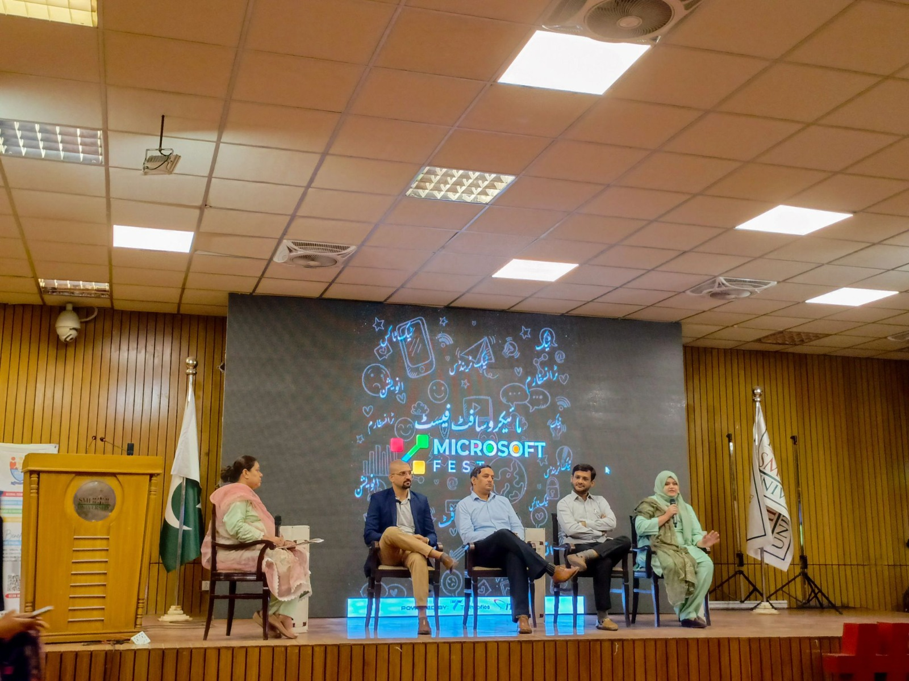
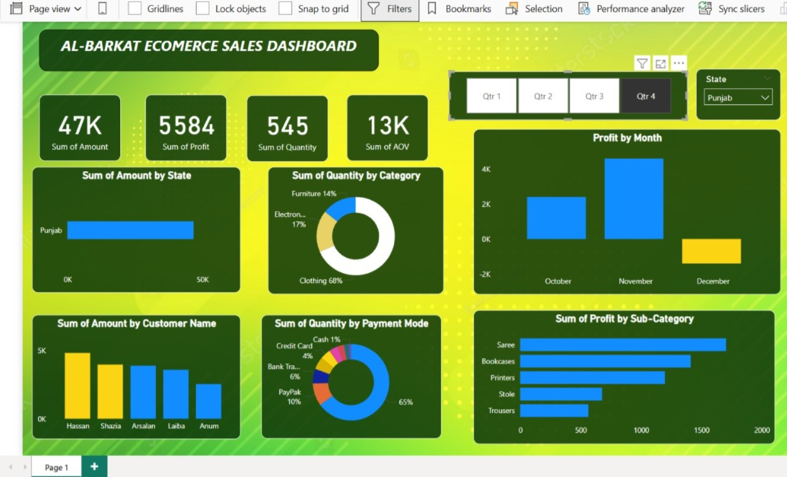

Update Manual

1- Changing Profile Pic

Jab profile pic update karni ha tu, index.html mai profile section mai <!-- Change Profile Pic Here--> pr ja kar
{ src="./assets/profile/profile-pic-7.0.png" } is code mai apni new profile pic ka path dena ha.
IMPORTANT NOTE! new profile pic ko hamesha assests mai mojood folder profile mai save karna ha, existing profile pic name ky according.

2- Updating Resume

Resume update karny ky liya profile ky section my jain gy whn <!-- Resume Update Here --> pr { onclick="window.open('./assets/resume.pdf')" } ky code my "resume.pdf" pr new resume ka path dain ga.
IMPORTANT NOTE! Updated resume ko resume2.pdf ky nam sa save karin taky yaad rahy ye updated resume ha.

3- Changing About Pic

Jab about pic update karni ha tu, index.html mai about section mai <!-- About Pic Update Here --> pr ja kar
{ src="./assets/profile/profile-pic-8.0.jpeg" } is code mai apni new about pic ka path dena ha.
IMPORTANT NOTE! new about pic ko hamesha assests mai mojood folder profile mai save karna ha, existing profile pic name ky according.

4- Changing About Paraghraph

Jab about paraghraph update karna hu tu, index.html mai about section mai <!-- About Update Here --> pr ja kar
{ 

 } is tag mai apni new about ka type ye paste karin. \*<strong></strong> ye tag text ko bold karny ky liya use karin.

5- Add Skills

New skills add karny ky liya, index.html mai Skill section mai <!-- More Skills --> pr ja kar usky uper
{ <article>

 

    <h3 style="padding-top: 1rem">Microsoft Excel</h3>
 

</article> }
is code ko add karin gy img src pr logo or icon ki pic ka path dena ha.

6- Add Events

New Events ko add karny ky liya index.html mai events section pr jain gy whn <!-- Add Events Here --> pr ja ky usky uper
{ 

<h3>Microsoft Fest 2024 MLSC-SMIU</h3>
 

Attended Microsoft Fest 2024, organized by MLSC-SMIU. Gained
valuable insights on Copilot, prompt engineering, and career growth
from industry experts.

 }
is code ko place karin gy img src mai new evwnts pics ka path dain gy jo ky assets mai mojod events folder mai apny save ki hn gi, or caption ko update karin gy.

7- Leadership & Activities Update

Leadership & Activities mai or Leadership & Activities add karny ky liya index.html mai <!-- Add more Leadership & Activities Here  --> pr jaky usky uper
{

<article>
<i class="fas fa-desktop fa-Vol"></i>

<h3 style="padding-left: 0.5rem">Live Sessions</h3>

Delivered interactive online sessions on SQL with 50+
attendees. Covered all concepts through real-world hands-on
examples.

</article>
} is code ko paste karna ha or pr edit kar lena ha.

8- Adding Projects

project add karny ky liya project.html mai jana ha whn pr <!-- Add Projects Here --> ky uper
{

            <a
              href="https://github.com/ayesha-105/Al_Barkat_Ecommerce_Store_Dashboard" {github link here}
              style="text-decoration: none"
            >
              

                
              

              <h2 class="experience-sub-title project-title">
                Al-Barkat E-commerce Sales Dashboard 📊
              </h2>
              

                This Dashboard built in <strong style="color: #fff;">Power BI</strong>, showcasing
                sales insights by quarter, state, category, and customer. Used
                interactive visuals like cards, bar charts, pie charts, and
                slicers to generate meaningful business insights.
              

            </a>
          

}
is code ko paste kar lena ha or img src mai project pic ka path dena ha, github pr github repo ka link, linkedin post ha agar tu whn pr linkedin post ka link agar nhi ha tu is button ko remove kar dena ha.

IN SAB MAI SA KOI BI UPDATE KARNY PR SAVE KARNY KY BAD ISKO GIHUB PR PUSH KAR DAIN THORI DAIR BAD PROFILE UPDATE HU JAY GI.
